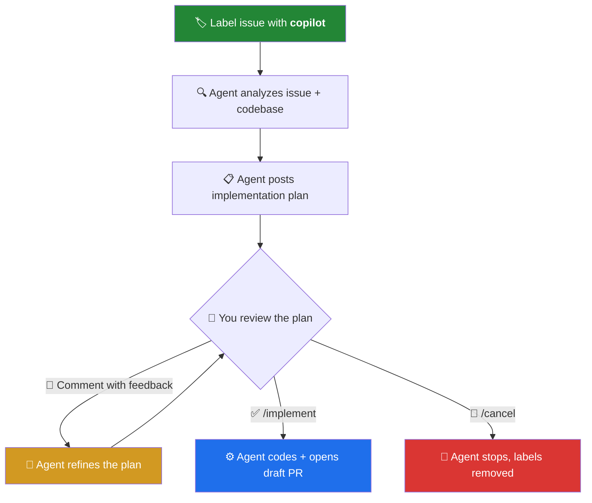
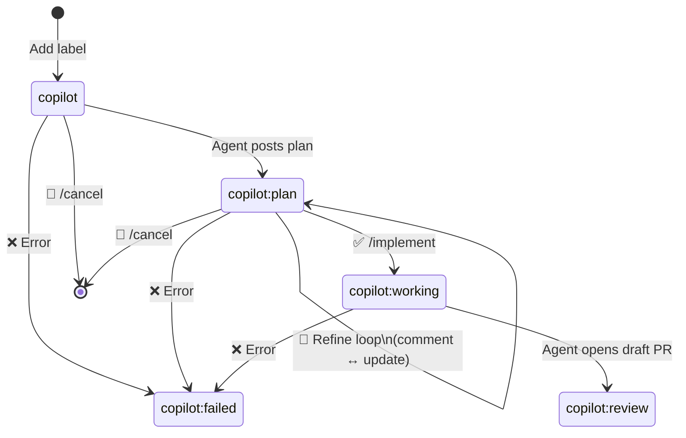

# 🤖 Copilot Issue Agent

**Label-to-PR Autopilot** — A GitHub Composite Action that turns issues into pull requests using the GitHub Copilot SDK. Add a label to an issue, get an implementation plan, refine it through conversation, and let the agent implement the code and open a draft PR.

## Why This Exists

GitHub.com offers powerful built-in agent capabilities like [Copilot Coding Agent](https://docs.github.com/en/copilot/using-github-copilot/using-copilot-coding-agent) — you can assign an issue to Copilot and it will autonomously analyze the codebase, write code, and open a pull request. It integrates deeply into the GitHub workflow with features like [Copilot code review](https://docs.github.com/en/copilot/using-github-copilot/code-review/using-copilot-code-review) and [Copilot Extensions](https://docs.github.com/en/copilot/using-github-copilot/using-extensions-to-integrate-external-tools).

**These features are not available on GitHub Enterprise Server (GHES).**

GHES instances [lag behind github.com in feature availability](https://docs.github.com/en/enterprise-server@latest/admin/all-releases), and many Copilot-powered features — including the coding agent, code review, and the ability to assign issues directly to Copilot — are either unavailable or significantly delayed on GHES.

**This action bridges that gap.** By combining the [GitHub Copilot SDK](https://www.npmjs.com/package/@github/copilot) with a standard GitHub Actions workflow, it replicates the core agent experience on any GitHub instance — including GHES. The only requirement is that the PAT owner has an active Copilot license with access to the Copilot API.

> **TL;DR:** If you're on GHES and want Copilot to work on your issues like it does on github.com — this action is for you.

## Why a Composite Action?

This project is packaged as a [Composite Action](https://docs.github.com/en/actions/sharing-automations/creating-actions/creating-a-composite-action) rather than a Docker or JavaScript action. This is a deliberate choice for maximum portability — especially on GHES:

- **No build step required.** Composite actions are just YAML + scripts. They run directly on the caller's runner without building a container image or bundling Node.js modules.
- **Works on any runner.** Self-hosted runners on GHES don't always have Docker available. Composite actions only need a shell, so they work everywhere — `ubuntu-latest`, `[self-hosted, linux]`, or any custom runner label.
- **Easy to share across an enterprise.** On GHES, you can host this action in an [internal repository](https://docs.github.com/en/enterprise-server@latest/repositories/creating-and-managing-repositories/about-repositories#about-internal-repositories) visible to all organization members. Any repo in the same GHES instance can then reference it with `uses: your-org/issue-implementer@v1` — no marketplace publishing needed.
- **Transparent and auditable.** All logic lives in plain Python scripts and a YAML file. Enterprise security teams can review exactly what runs before approving it for use across the organization.

### Sharing on GHES

To make this action available across your GHES organization:

1. **Fork or mirror** this repository into your GHES instance as an **internal** repository (e.g. `your-org/copilot-issue-agent`)
2. **Tag a release** (e.g. `v1`) so consumers can pin to a stable version
3. **Enable Actions access** — go to the repo's Settings → Actions → General → [Access](https://docs.github.com/en/enterprise-server@latest/repositories/managing-your-repositorys-settings-and-features/enabling-features-for-your-repository/managing-github-actions-settings-for-a-repository#allowing-access-to-components-in-an-internal-repository) and select *"Accessible from repositories in the organization"* (or enterprise)
4. **Consumers** add the workflow to their repo referencing `your-org/copilot-issue-agent@v1` — that's it

No marketplace, no container registry, no npm packages. Just a Git repo with a tag.

## How It Works

The agent operates in a **plan → refine → implement** loop driven entirely by labels and issue comments:



### Phase Details

| Phase | Trigger | What Happens | Label After |
|-------|---------|-------------|-------------|
| **Plan** | Add label `copilot` to an issue | Agent reads the issue, analyzes the codebase, and posts a structured implementation plan as a comment | `copilot:plan` |
| **Refine** | Comment on a `copilot:plan` issue (any text except commands) | Agent reads your feedback, revises the plan, and posts an updated version | `copilot:plan` |
| **Implement** | Comment `/implement` on a `copilot:plan` issue | Agent creates a branch, implements code per plan, pushes, and opens a draft PR | `copilot:review` |
| **Cancel** | Comment `/cancel` on any copilot-managed issue | Removes all copilot labels and posts a cancellation notice | *(labels removed)* |

The refine loop is unlimited — you can go back and forth with the agent as many times as needed before triggering implementation.

## Quick Start

### 1. Create a Fine-Grained PAT

You need a Personal Access Token with **Copilot** permission (for SDK access) and **Repository** read/write permissions.

Go to [Settings → Developer settings → Fine-grained tokens](https://github.com/settings/personal-access-tokens/new) and create a token with:
- **Repository access**: Select the target repository
- **Permissions**:
  - `Copilot` → Read
  - `Contents` → Read and write
  - `Issues` → Read and write
  - `Pull requests` → Read and write

### 2. Add the PAT as a Repository Secret

```bash
gh secret set COPILOT_PAT --repo <owner>/<repo>
```

### 3. Enable Actions PR Permissions

Go to your repo → **Settings → Actions → General → Workflow permissions**:
- Select **Read and write permissions**
- Check **Allow GitHub Actions to create and approve pull requests**

Or via CLI:

```bash
gh api repos/<owner>/<repo>/actions/permissions/workflow \
  -X PUT -f default_workflow_permissions=write \
  -F can_approve_pull_request_reviews=true
```

### 4. Create the Workflow File

Create `.github/workflows/copilot.yml` in your repository:

```yaml
name: Copilot Issue Agent

on:
  issues:
    types: [labeled]
  issue_comment:
    types: [created]

permissions:
  contents: write
  issues: write
  pull-requests: write

jobs:
  copilot:
    runs-on: ubuntu-latest
    steps:
      - uses: actions/checkout@v4
      - uses: jeffreygroneberg/issue-implementer@v1
        with:
          copilot-pat: ${{ secrets.COPILOT_PAT }}
```

The action handles all event filtering internally — it detects the mode (plan, refine, implement, cancel, or skip) and only runs when relevant.

### 5. Try It Out

Labels are **created automatically** on the first run. The action ensures these labels exist:

| Label | Purpose |
|-------|---------|
| `copilot` | Trigger label — add this to start the agent |
| `copilot:plan` | Set by agent after posting a plan |
| `copilot:working` | Set by agent during implementation |
| `copilot:review` | Set by agent after opening a PR |
| `copilot:failed` | Set by agent on errors |

To get started:

1. Open a new issue describing a feature or bug fix
2. Add the `copilot` label
3. Wait ~2 minutes — the agent will post an implementation plan
4. Comment with feedback to refine, or type `/implement` to go

## Interacting with the Agent

### Starting the Agent

Add the `copilot` label to any open issue. The agent will:
1. React with 👀 to acknowledge
2. Analyze the repository structure and code
3. Post a detailed implementation plan as a comment
4. Change the label from `copilot` → `copilot:plan`

### Refining the Plan

Once a plan is posted, simply **comment on the issue** with your feedback. Examples:

> "Please also add input validation for negative exponents"

> "Use the existing `MathUtils` class instead of creating a new file"

> "Add error handling for division by zero"

The agent reads your feedback along with the full conversation history, updates the plan, and posts a new version. You can refine as many times as you want.

### Implementing

When the plan looks good, comment:

```
/implement
```

The agent will:
1. Create a branch `copilot/issue-<number>`
2. Implement code following the approved plan
3. Commit with conventional commit messages
4. Push and open a draft PR linked to the issue
5. Update the label to `copilot:review`

### Cancelling

At any point, comment:

```
/cancel
```

This removes all copilot labels and stops the agent.

## Configuration

### Action Inputs

```yaml
- uses: jeffreygroneberg/issue-implementer@v1
  with:
    # Required: PAT with Copilot permission
    copilot-pat: ${{ secrets.COPILOT_PAT }}

    # Optional: Copilot model (default: gpt-5.2)
    model: 'gpt-5.2'

    # Optional: Max files the agent can change (default: 10)
    max-files-changed: '10'

    # Optional: Agent timeout in minutes (default: 15)
    timeout-minutes: '15'

    # Optional: Reasoning effort — low, medium, high, xhigh (default: high)
    reasoning-effort: 'high'
```

### Repository Config File

You can also customize behavior by creating `.github/copilot-agent.yml` in your repository:

```yaml
# Trigger label (default: copilot)
trigger_label: copilot

# Commands recognized in comments
implement_command: /implement
cancel_command: /cancel

# Model and reasoning
model: gpt-5.2
reasoning_effort: high

# Safety limits
max_refinement_rounds: 10
max_files_changed: 10
timeout_minutes: 15

# Additional instructions appended to the agent's system prompt
additional_instructions: |
  Always write tests for new functions.
  Use TypeScript strict mode.
  Follow the existing project conventions.
```

Action inputs take precedence over the config file. Environment variables take precedence over both.

## Architecture

```
action.yml                  ← Composite Action entry point (mode detection)
scripts/
  plan_issue.py             ← Plan phase: analyze issue → post plan
  refine_plan.py            ← Refine phase: process feedback → update plan
  implement_issue.py        ← Implement phase: code changes → draft PR
  shared/
    config.py               ← Configuration loader (YAML + env vars)
    copilot_client.py       ← Copilot SDK client with safety hooks
skills/
  issue-planner/
    SKILL.md                ← Skill definition for planning/refining
  issue-implementer/
    SKILL.md                ← Skill definition for implementation
```

### Mode Detection

The action detects what to do based on the GitHub event:

| Event | Condition | Mode |
|-------|-----------|------|
| `issues` / `labeled` | Label is `copilot` | **plan** |
| `issue_comment` / `created` | Any text, issue has `copilot:plan` | **refine** |
| `issue_comment` / `created` | `/implement`, issue has `copilot:plan` | **implement** |
| `issue_comment` / `created` | `/cancel` | **cancel** |
| Any | Issue is closed | **skip** |

### Safety Guardrails

The agent runs with several safety mechanisms:

- **Tool allowlist**: Only `bash`, `glob`, `view`, `web_fetch`, `report_intent`, `task` are available (plus `write_file`/`read_file` during implementation)
- **Shell command allowlist**: Only `gh`, `git`, `cat`, `find`, `grep`, and similar read-safe commands are permitted
- **Blocked patterns**: `rm -r`, `sudo`, `chmod`, `wget`, `curl` (non-localhost), and other destructive commands are blocked
- **File change limit**: Configurable cap on how many files the agent can write (default: 10)
- **Timeout**: Configurable session timeout (default: 15 minutes)

## Labels Lifecycle



## Requirements

- **GitHub Actions runner**: `ubuntu-latest` (or any runner with Python 3.11+ and Node.js 22+)
- **GitHub Copilot**: The PAT owner must have an active Copilot license
- **Repository permissions**: The workflow needs `contents: write`, `issues: write`, and `pull-requests: write`

## License

MIT
